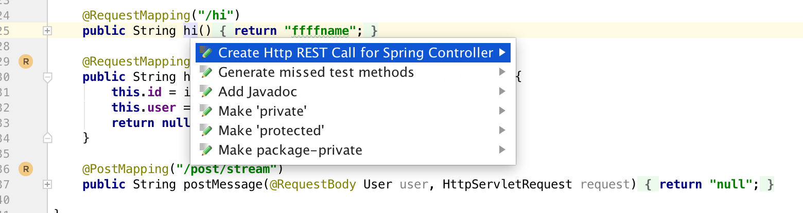
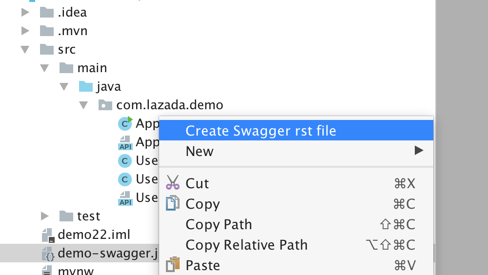
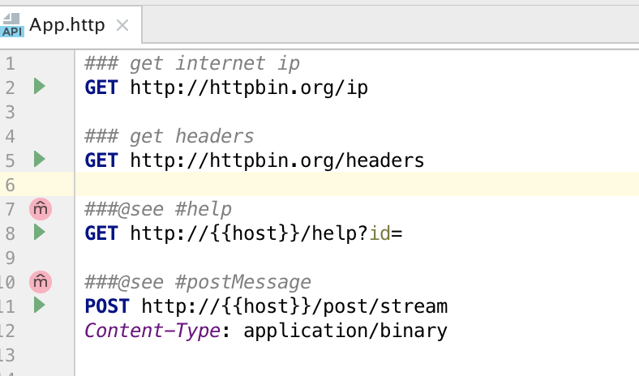
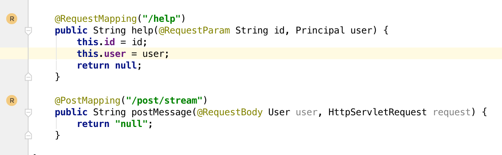

REST Editor Client Contrib
==========================

# Features

* Generate rst file from Swagger json
* Generate rst file for Spring MVC Controller
* Generate rst file from Swagger API
* Connect method with related action in rst file

# Code Generation

* Spring Controller



* Swagger Json



# Navigation

* Refer handler



```
###@see #help
###@see ClassName#welcome 
 
```

* Navigate to http request



